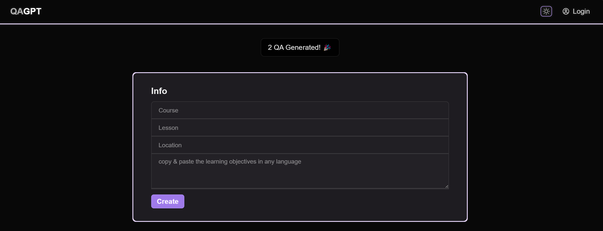

# BingoGPT

## Overview
QAPGPT brings an innovative twist to the classic game of Bingo by integrating GPT-powered prompts to generate unique Bingo cards and corresponding question lists.

## Features
- Automatically generate Bingo cards with answers derived from GPT prompts.
- Create customized question lists that correspond to each Bingo card's answers.
- Simple and intuitive user interface for creating and printing Bingo cards and questions.
  
## Running it locally
After cloning this repo, you can run it locally by following these steps:

1. Install [Wasp](https://wasp-lang.dev) by running `curl -sSL https://get.wasp-lang.dev/installer.sh | sh` in your terminal.
2. Create a `.env.server` file in the root of the project
3. Copy the `env.server.example` file contents to `.env.server` and fill in your API keys
4. Make sure you have a Database connected and running. Here are two quick options:
  - run `wasp start db` from the project root. You need to have Docker installed (if not, on MacOS run `brew install docker-machine docker` and start the Docker app). This will start a Postgres database and configure it for you. No need to do anything else!
  - or provision a Postgres database on [Railway](https://railway.app), go to settings and copy the connection url. Paste it as DATABASE_URL=<your-postgres-connection-url> into your env.server file.
5. Run `wasp db migrate-dev`
6. Run `wasp start`
7. Go to `localhost:3000` in your browser (your NodeJS server will be running on port `3001`)
8. install the [Wasp extension for VSCode](https://marketplace.visualstudio.com/items?itemName=wasp-lang.wasp) for the best DX
